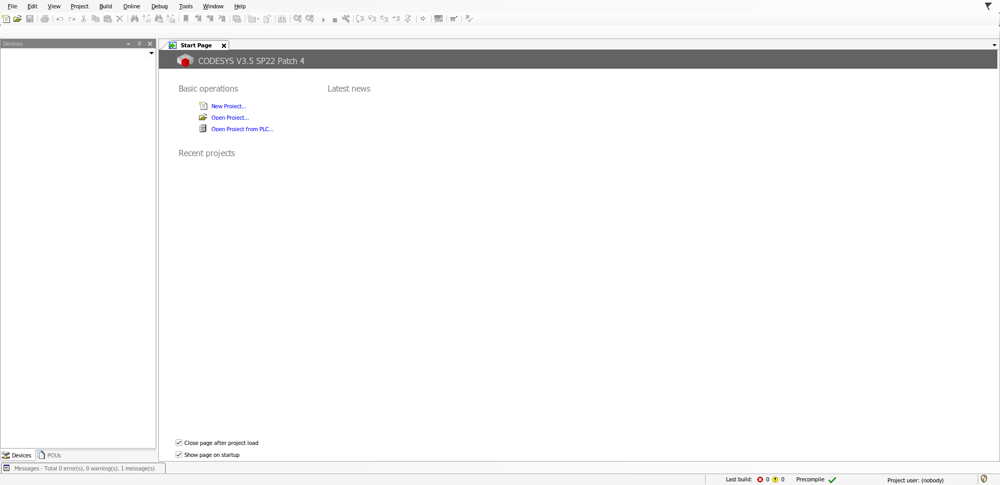
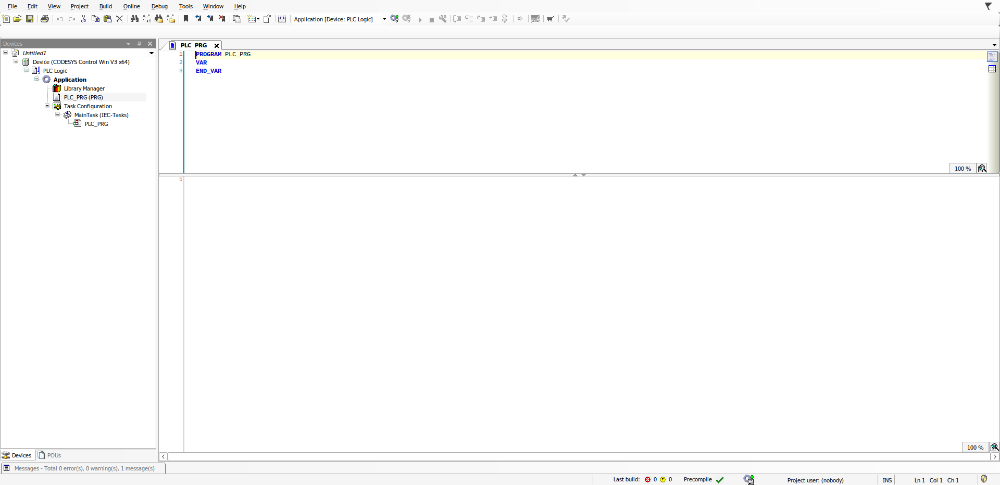
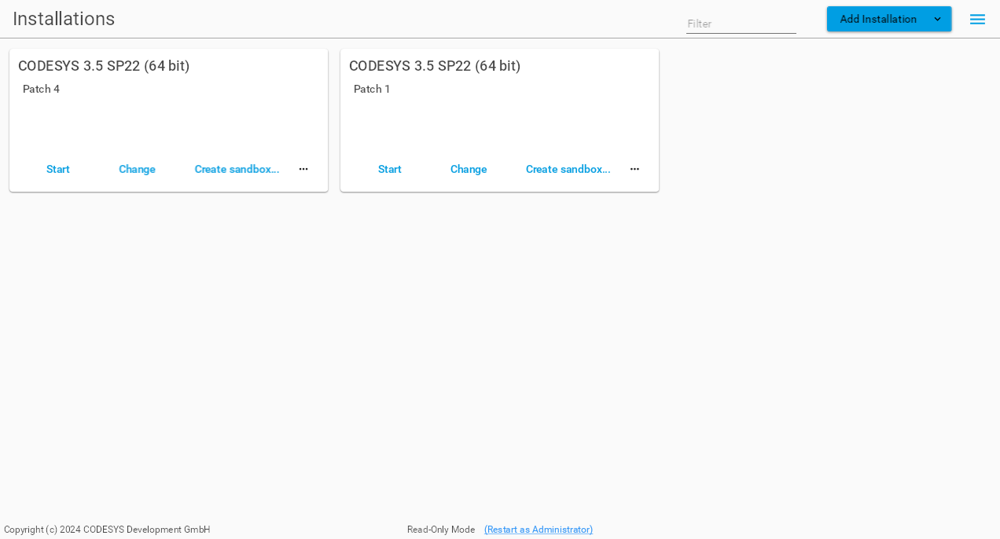

# codesys-wine

Run the **CODESYS V3.5 Development System** (64-bit IDE) on Linux with WINE.

> Unofficial. Neither CODESYS GmbH nor WineHQ supports this setup. This repository has no CODESYS binaries. Download the installer from the [CODESYS Store](https://store.codesys.com) yourself.

## About

### What is this

A script and a set of fixes that install the Windows-only CODESYS V3.5 IDE into its own WINE prefix on Linux. You get a desktop launcher, the editors and compiler, the bundled add-on packages and the CODESYS Installer, all without a Windows VM. Two WINE gaps that block online login and some package installs are fixed by small WINE patches in [wine-patches/](wine-patches/).

### Original solution

This builds on earlier work by others:

- **[livingforjesus/codesys-macos-install-guide](https://github.com/livingforjesus/codesys-macos-install-guide)**, a 2026 guide that got CODESYS SP22 running on macOS with WINE 11. Its key ideas are the per-program `security.dll` override and installing the MSI directly. This repository adapts that recipe to Linux and extends it.
- **[CODESYS Forge: codesys-4-linux](https://forge.codesys.com/tol/codesys-4-linux/home/Manual%20Installation/)**, the older Forge project for running CODESYS under WINE. It targets earlier service packs.
- Forge discussions that first pinned the WINE crypto gap: [SP17 under WINE](https://forge.codesys.com/forge/talk/Engineering/thread/dec16e8f25/) and [SP18/SP20 under WINE](https://forge.codesys.com/forge/talk/forge/thread/fabde5513b/).

### Quickstart

```sh
git clone https://github.com/Re-CODESYS/codesys-wine.git && cd codesys-wine
install/install.sh --full ~/Downloads/"CODESYS 64 3.5.22.40.exe"
```

Then start CODESYS from the desktop menu, or with `~/.local/bin/codesys-3.5.22.40`. Leave out `--full` for a quicker core-only install (see [Installation in detail](#installation-in-detail)).

### Screenshots

| | |
|---|---|
|  |  |
| SP22 Patch 4 start page | Standard project, ready to build |
|  | |
| CODESYS Installer 2.6.1 | |

More screenshots are welcome (build output, Visualization editor, online login).

### Tested with

| CODESYS | WINE | OS | Result |
|---|---|---|---|
| V3.5 SP22 Patch 4 (3.5.22.40) | winehq-stable 11.0 | Debian 13 (trixie), x86-64 | IDE, build, 43 bundled packages, CODESYS Installer |
| V3.5 SP22 Patch 1 (3.5.22.10) | winehq-stable 11.0 | Debian 13 (trixie), x86-64 | IDE, build |
| V3.5 SP22 Patch 4 (3.5.22.40) | WINE master 11.18 + [wine-patches](wine-patches/) | Debian 13 (trixie), x86-64 | Also **simulation login**, and package installs including Start-menu links |
| V3.5 SP22 Patch 4 (3.5.22.40) | winehq-stable 11.0 + patched `ncrypt.dll`/`bcrypt.dll` ([drop-in](wine-patches/#route-a-drop-in-dlls-for-stock-winehq-stable-110)) | Debian 13 (trixie), x86-64 | Also **simulation login** |

The test machine is an Intel i7-7500U laptop with Intel HD 620 graphics, running KDE Plasma on Wayland. Ubuntu and older WINE versions are not tested yet; reports are welcome.

### Current features

- One-command install into a dedicated WINE prefix, with a launcher and a menu entry.
- Editors, project handling and compiling (a standard project builds with 0 errors).
- All add-on packages bundled with the setup (`--packages`), including Scripting, Visualization and its **Visual Style Editor** and **HTML5 Control Editor**.
- **CODESYS Installer 2.6.1** (`--installer`), for listing installations and installing add-ons.
- Several CODESYS versions side by side in one prefix.
- With patched WINE, or two patched DLLs dropped into the prefix: **online login to the simulation**.

Planned: **agentic help for installation and management**, as an agent skill plus tools, so an AI assistant like Claude can install, update, diagnose and maintain CODESYS-on-WINE setups for you.

### Known limitations

- **Online login fails on stock WINE** (`Unknown error "-2146893783"`). It needs two patched DLLs in the prefix, or a [patched WINE](wine-patches/), until the fix is in a WINE release. Real PLCs are not tested yet.
- **No CodeMeter:** licensed add-ons and USB dongles don't work, and **Application Composer** is skipped because its plug-in is CodeMeter-protected.
- **No Windows Gateway or Control Win.** For PLC communication, run CODESYS Control for Linux SL or the Edge Gateway for Linux natively (untested).
- **On stock WINE, packages can't create Start-menu links.** Installing still works if `--cancelOnException` is left off, which `install.sh` does.
- **Installing add-ons in the CODESYS Installer needs admin rights.** See [the FAQ](#faq).
- **First start takes several minutes.** The start page's "Latest news" stays empty.

Details and fixes: [docs/troubleshooting.md](docs/troubleshooting.md).

## Installation in detail

### Requirements

- x86-64 Linux with WINE **11.0 or newer**, 64-bit and 32-bit (WineHQ packages: `winehq-stable`), plus `winetricks` and `python3`. `--packages` also needs `7z` (Debian/Ubuntu package `7zip`).
- Locale `en_US.UTF-8` generated (`locale -a`).
- About 6 GB of free disk space for the core install, and about 9 GB with `--full`. You also need internet access for winetricks.
- The official `CODESYS 64 3.5.x.y.exe` installer.

### What install.sh does

```sh
install/install.sh [--installer] [--packages] [--full] ~/Downloads/"CODESYS 64 3.5.22.40.exe"
```

1. Creates a dedicated win64 prefix at `~/.local/share/wineprefixes/codesys`. You can override this with `WINEPREFIX=`.
2. Installs `dotnet48 vcrun2022 msxml6 win10 webview2` with winetricks.
3. Sets a per-program `*security=native` DLL override for the CODESYS tools. See [the FAQ](#why-do-you-change-a-dll-in-wine).
4. Re-registers `oleaut32` and turns off WPF hardware acceleration.
5. Unpacks the InstallShield EXE with `install/tools/is_extract.py`, then runs the CODESYS MSI silently. It leaves out CodeMeter and the Windows Gateway and Control Win services.
6. Optionally installs the CODESYS Installer and the bundled packages (see below).
7. Creates the launcher `~/.local/bin/codesys-<version>` and a desktop menu entry. With a non-default `WINEPREFIX`, the prefix name is appended, for example `codesys-3.5.22.40-test`.

| Option | What it adds |
|---|---|
| `--installer` | **CODESYS Installer 2.6.1** (APInstaller) with the .NET 8 Desktop Runtime it needs, both taken from the CODESYS setup. |
| `--packages` | The **add-on packages bundled with the setup**, as a Windows install would include. They are installed one at a time with `PackageManagerCLI`. This takes about an hour. Application Composer is skipped (CodeMeter). |
| `--full` | Both. |
| `--no-crypto-fix` | Skips the online-login fix (see below). It is **on by default**. |
| `--crypto-fix-dlls DIR` | Where the patched `ncrypt`/`bcrypt` DLLs are: a release folder or a WINE build tree. |
| `--yes` | Doesn't ask questions. |

The script can be re-run safely: finished steps and installed packages are skipped. Running it with another installer version adds that version side by side in the same prefix.

The silent install passes `AgreeToLicense=Yes`. Read the CODESYS license before you run it.

Installers this was tested with (SHA256):

```
4dae598fc3d2143b8ebdddceba34ac2a73009b1eb001d8d553085a8fb0478ad7  CODESYS 64 3.5.22.40.exe
c3d493c2d1df71a539fdb34a31dbaec4e53610ec6a2b817b388b4e1e2a4ba1a9  CODESYS 64 3.5.22.10.exe
```

### Online login: patched WINE

Online login needs a WINE fix that isn't in a WINE release yet. [wine-patches/](wine-patches/) describes two ways to get it:

- **Drop-in DLLs (Route A):** copy patched `ncrypt.dll` and `bcrypt.dll` into the CODESYS prefix and enable them for `CODESYS.exe` only. Your system WINE (stable 11.0) stays as it is. `install.sh` does this for you by default, using `install/crypto-fix.sh`:
  - It first explains what it changes and asks.
  - It only acts on a tested WINE version (11.0), and refuses while programs run in the prefix.
  - It keeps a backup of WINE's DLLs. `install/crypto-fix.sh remove` restores them, and `install/crypto-fix.sh status` shows the current state.
  - It is skipped if no patched DLLs are found. Until a release with the DLLs is published, point it at a [Route B build](wine-patches/) with `--crypto-fix-dlls ~/wine-dev/build`.
- **Patched WINE build (Route B):** builds WINE master with the patches into `~/wine-dev` and runs it from there. Use it on a copy of your prefix.

[tests/](tests/) has a headless login test.

### FAQ

#### Why do you change a DLL in WINE?

We don't modify any WINE files. There are two separate things:

1. **The `security.dll` override** (always applied). CODESYS ships a .NET assembly called `Security.dll`. WINE has its own built-in Windows DLL with the same name, and by default WINE loads its own. CODESYS then fails with `BadImageFormatException`. The override is a registry setting in the CODESYS prefix: `*security=native` under `AppDefaults\<program>.exe`. It tells WINE to load the CODESYS file instead, and only for the listed CODESYS programs. A global override would break other programs, so the script sets it per program.
2. **The WINE patches** (optional, for online login). Two WINE functions were missing. `NCryptEncrypt` refused the RSA-OAEP padding CODESYS uses to encrypt the login, and `IShellLinkDataList::RemoveDataBlock` was a stub. You either drop two patched DLLs into the CODESYS prefix, used by `CODESYS.exe` only, or build a separate patched WINE that runs from a folder in your home directory.

#### Is it safe?

- The override applies only inside the CODESYS prefix and only to CODESYS programs. Deleting the prefix removes it.
- Neither the drop-in DLLs nor the patched WINE build replace or change the system WINE. The drop-in DLLs live inside the prefix and are only used by `CODESYS.exe`. The patches are short and readable, and they include WINE's own conformance tests. Read them in [wine-patches/](wine-patches/).
- A WINE prefix is **not a sandbox**. Windows programs in it can read and write your home directory, just like with any WINE setup.
- Nothing in `install.sh` needs `sudo` or admin rights. Building the patched WINE needs `sudo` once, for the build dependencies.

#### Is it supported?

No. CODESYS GmbH supports Windows only, and the WINE patches aren't upstream yet. Treat this as a way to edit and build projects on Linux. For commissioning and production work on real machines, use a supported Windows setup until online behaviour is well tested.

#### Which WINE version do I need?

- **WINE 11.0** (stable) for the IDE, building and packages.
- For online login, either **WINE 11.0 plus the drop-in `ncrypt.dll` and `bcrypt.dll`** (both built from WINE master with the patches; the bcrypt one brings a fix that 11.0 lacks), or **a WINE 11.5 or newer build with the patches**.

#### Why does the CODESYS Installer say "Read-Only Mode"?

WINE starts programs as a limited administrator. Click **Restart as Administrator** in the Installer. From the command line, start `APInstaller.CLI.exe` through `install/tools/runas.vbs`, which uses Windows' "run as administrator". A cleaner Linux-side approach is still open.

#### Can I use my CODESYS license or dongle?

Not yet. CodeMeter isn't installed. A possible route is having the Windows CodeMeter client in WINE talk to a CodeMeter runtime running natively on Linux. That is untested.

## Contribution: testing and bug reports

Reports from other distributions, WINE versions and CODESYS versions help the most. That includes reports that it works.

Please [open an issue](https://github.com/Re-CODESYS/codesys-wine/issues) with:

- Your distribution and version, desktop (X11 or Wayland), and GPU.
- `wine --version`, and whether you used stable WINE or the patched build.
- The CODESYS installer file name and SHA256, and the `install.sh` options you used.
- What happened, the exact error text, and a screenshot of any dialog.
- Logs from the prefix:
  - `codesys-launch.log`
  - `drive_c/codesys-<version>-install.log`
  - for packages, `drive_c/codesys-packages/<version>/<package>.log`

For crashes and "not supported" or "not implemented" errors, a WINE trace makes the cause much easier to find. [docs/troubleshooting.md](docs/troubleshooting.md) explains how to capture one.

Pull requests are welcome. Scripts are MIT-licensed ([LICENSE](LICENSE)). WINE patches are LGPL-2.1+, like WINE itself ([wine-patches/COPYING](wine-patches/COPYING)). Never add CODESYS binaries, installers or packages to the repository.

## Credits

- [livingforjesus/codesys-macos-install-guide](https://github.com/livingforjesus/codesys-macos-install-guide) for the SP22 recipe this started from.
- [ISx](https://github.com/lifenjoiner/ISx) for documenting the InstallShield stream format. `install/tools/is_extract.py` is an independent pure-Python implementation.
- The [CODESYS Forge](https://forge.codesys.com) community for years of WINE reports.
